# Recommended Products Feature - Implementation Plan

## 📋 **Current State Overview**

### **Existing Application**
- **Name**: Data Science UI Mockup Tool (Grocery Store Data Explorer)
- **Framework**: Streamlit with interactive hierarchy navigation
- **Data Structure**: 4-level hierarchy (Departments → Categories → Subcategories → Products)
- **Key Features**:
  - Documentation and architecture overview
  - Interactive data explorer with hierarchical filtering
  - Tree hierarchy with multi-level selection using `streamlit-tree-select`
  - Quality evolution charts with temporal analysis
  - CSV-based data storage (no database required)

### **Current Data Files**
```
data/
├── departments.csv      # 8 departments (Fresh Foods, Packaged Goods, etc.)
├── categories.csv       # 24 categories (Fruits, Vegetables, Dairy, etc.)
├── subcategories.csv    # 72 subcategories (Citrus Fruits, Leafy Greens, etc.)
├── products.csv         # 500+ individual products with pricing/inventory
└── temporal_quality.csv # Quality tracking over time periods
```

---

## 🎯 **Use Case & Requirements**

### **Business Problem**
- **Weekly Recommendations**: New grocery items are automatically suggested for the store
- **Manual Approval Process**: Recommendations should not auto-add to the live hierarchy
- **Batch Review Workflow**: Managers review recommendations every few months (not weekly)
- **Contextual Placement**: Users need to see where recommended items would appear in the hierarchy
- **Bulk Operations**: Ability to approve/reject multiple items efficiently

### **Approval Workflow Overview**


### **Core Requirements**
1. **Visual Integration**: Recommended products appear in-place within the hierarchy with visual indicators
2. **Toggle Visibility**: Show/hide recommended products as needed
3. **Approval Actions**: Individual and bulk approve/reject capabilities
4. **Contextual Review**: See products in their suggested hierarchy positions
5. **Complete Audit Trail**: Comprehensive history of all approval/rejection decisions with timestamps, user attribution, and reasoning
6. **Data Persistence**: Maintain approval states between sessions
7. **Historical Analytics**: Track approval patterns, decision timelines, and recommendation accuracy over time

---

## 🏗️ **Technical Approach**

### **Design Philosophy**
- **In-Place Approval**: Recommended products are pre-placed in hierarchy with visual flags
- **Minimal UI Disruption**: Enhance existing tree interface rather than creating new workflows
- **Keep/Remove Decision**: Users decide whether to keep auto-placed recommendations
- **Visual Indicators**: Clear status badges for different product states

### **Recommended Architecture**
- **Enhanced Tree View**: Extend current `streamlit-tree-select` with status indicators
- **Status-Based Filtering**: Dynamic show/hide based on product approval state
- **CSV-Based State Management**: Add status columns to existing product data
- **Session State Tracking**: Maintain UI state for review sessions

---

## 📊 **Data Architecture Changes**

### **Enhanced Product Schema**
```python
# products.csv - Additional Columns:
- status: 'approved' | 'recommended' | 'rejected'  # Product approval state
- recommendation_date: datetime                     # When item was suggested
- reviewed_by: string                              # Who made the approval decision
- review_date: datetime                            # When decision was made
- recommendation_source: string                    # Source of recommendation (AI, manual, etc.)
```

### **New Data Files**
```
data/
├── approved_hierarchy/          # Current production data
│   ├── departments.csv
│   ├── categories.csv
│   ├── subcategories.csv
│   └── products.csv
├── workflow_tracking/          # Audit trail
│   ├── approval_history.csv    # Complete approval history
│   └── review_sessions.csv     # Manager review session tracking
└── temporal_quality.csv       # Existing quality data
```

### **Data Architecture & Relationships**


### **Comprehensive Approval History Schema**
```python
# approval_history.csv - Complete audit trail of all decisions:
- history_id: int                       # Unique identifier for each history record
- product_id: int                       # Reference to the product
- product_name: string                  # Product name at time of decision (may change later)
- action: 'approved' | 'rejected' | 'deferred' | 'moved' | 'edited'  # Type of action taken
- previous_status: string               # Status before this action
- new_status: string                    # Status after this action
- reviewed_by: string                   # User/manager who made the decision
- review_date: datetime                 # Timestamp of decision
- review_session_id: string             # Groups decisions made in same session
- hierarchy_path: string                # "Department > Category > Subcategory" at time of decision
- decision_reason: string               # Optional reason/notes for the decision
- bulk_operation_id: string             # Links decisions made in bulk operations
- recommendation_confidence: float      # AI confidence score if applicable
- review_duration_seconds: int          # Time spent reviewing this item
- ip_address: string                    # Source IP for security/audit purposes
- user_agent: string                    # Browser/device information
```

```python
# review_sessions.csv - Track manager review sessions:
- session_id: string                    # Unique session identifier
- user_id: string                       # Manager/reviewer identifier
- start_time: datetime                  # When review session began
- end_time: datetime                    # When review session ended
- total_reviewed: int                   # Number of items reviewed
- total_approved: int                   # Number of items approved
- total_rejected: int                   # Number of items rejected
- total_deferred: int                   # Number of items deferred
- session_notes: string                 # General notes about the session
- batch_type: string                    # "weekly" | "monthly" | "adhoc"
```

```python
# decision_analytics.csv - Aggregated decision patterns:
- analytics_date: date                  # Date of analysis
- total_recommendations: int            # Total recommendations received
- approval_rate: float                  # Percentage approved
- rejection_rate: float                 # Percentage rejected
- avg_review_time_seconds: float        # Average time per decision
- most_approved_category: string        # Category with highest approval rate
- most_rejected_category: string        # Category with highest rejection rate
- recommendation_accuracy: float        # How often approved items perform well
```

---

## 🎨 **UI/UX Design Approach**

### **User Interface Flow**

```mermaid
flowchart LR
    A[Manager Opens App] --> B[Tree Hierarchy View]
    B --> C{Show Recommended?}
    C -->|Yes| D[See Products with 🔍 Icons]
    C -->|No| E[See Only Approved Products]
    D --> F[Select Products]
    F --> G[Bulk Actions Panel]
    G --> H{Choose Action}
    H -->|Approve| I[✅ Add to Live Hierarchy]
    H -->|Reject| J[❌ Remove from View]
    H -->|Defer| K[⏭️ Review Later]
    I --> L[Log Decision + Reason]
    J --> L
    K --> L
    L --> M[Update History Dashboard]
    
    style A fill:#e3f2fd
    style D fill:#fff3e0
    style I fill:#e8f5e8
    style J fill:#ffebee
    style L fill:#f3e5f5
```


### **Visual Status Indicators**
```python
# Tree Node Labels with Status:
"🔍 New Product Name (RECOMMENDED)"     # Pending recommendation
"✅ Approved Product Name"              # Approved for live hierarchy  
"❌ Rejected Product Name"              # Rejected (if showing rejected items)
"📦 Regular Product Name"               # Existing approved products
```

### **Filter Controls (Sidebar)**
```python
# User Controls:
show_recommended = st.checkbox("Show Recommended Products", value=True)
show_rejected = st.checkbox("Show Rejected Products", value=False)  
show_approved_only = st.checkbox("Show Only Approved Products", value=False)
review_mode = st.selectbox("Review Mode", ["All", "This Week", "This Month"])
```

### **Bulk Operations Interface**
```python
# Below Tree Selection:
if selected_recommended_products:
    st.subheader("📋 Review Selected Products")
    
    col1, col2, col3 = st.columns(3)
    with col1:
        st.button("✅ Approve Selected ({count})")
    with col2:
        st.button("❌ Reject Selected ({count})")
    with col3:
        st.button("⏭️ Review Later")
    
    # Optional decision reasoning
    decision_notes = st.text_area("Decision Notes (Optional)", 
                                 placeholder="Add reasoning for this decision...")
```

### **History & Audit Interface**
```python
# History Tab/Section:
st.subheader("📊 Approval History & Analytics")

# History filters
col1, col2, col3 = st.columns(3)
with col1:
    date_range = st.date_input("Date Range", value=[last_month, today])
with col2:
    reviewer_filter = st.selectbox("Reviewer", ["All"] + list_of_reviewers)
with col3:
    action_filter = st.multiselect("Actions", ["approved", "rejected", "deferred"])

# History display options
view_type = st.radio("View Type", ["Timeline", "Table", "Analytics"])

if view_type == "Timeline":
    # Interactive timeline showing decisions over time
    st.plotly_chart(create_decision_timeline(filtered_history))
    
elif view_type == "Table":
    # Detailed history table with search and filters
    st.dataframe(filtered_history, use_container_width=True)
    
elif view_type == "Analytics":
    # Dashboard with decision patterns and statistics
    col1, col2, col3 = st.columns(3)
    with col1:
        st.metric("Approval Rate", f"{approval_rate:.1%}")
    with col2:
        st.metric("Avg Review Time", f"{avg_time:.1f}s")
    with col3:
        st.metric("Total Decisions", total_decisions)
    
    # Charts showing patterns
    st.plotly_chart(create_approval_patterns_chart())
    st.plotly_chart(create_category_breakdown_chart())
```

### **Decision Reasoning Interface**
```python
# For individual product decisions:
if st.button("View Decision History", key=f"history_{product_id}"):
    with st.expander("📋 Decision History"):
        product_history = get_product_history(product_id)
        
        for decision in product_history:
            with st.container():
                col1, col2, col3 = st.columns([2, 1, 1])
                with col1:
                    st.write(f"**{decision.action.title()}** by {decision.reviewed_by}")
                    if decision.decision_reason:
                        st.write(f"*Reason: {decision.decision_reason}*")
                with col2:
                    st.write(decision.review_date.strftime("%Y-%m-%d %H:%M"))
                with col3:
                    st.write(f"Session: {decision.review_session_id[:8]}...")
```

---

## 🛠️ **Implementation Plan**

### **Implementation Timeline Overview**


### **Phase 1: Basic In-Place Approval** ⏱️ *~1-2 weeks*
**Goal**: Get core approval workflow working with existing UI

#### **Tasks**:
1. **Data Schema Enhancement**
   - Add status columns to products.csv
   - Create sample recommended products data
   - Implement status filtering logic

2. **Visual Indicators**
   - Enhance tree building function with status badges
   - Add emoji/icon indicators for product states
   - Implement show/hide filtering

3. **Basic Approval Actions**
   - Individual product approval buttons
   - Update CSV files with status changes
   - Basic history logging for all decisions
   - Simple success/error feedback

#### **Deliverables**:
- Products display with status indicators in tree
- Toggle to show/hide recommended products
- Click-to-approve individual products
- CSV persistence of approval decisions
- Basic approval history tracking (who, when, what)

### **Phase 2: Bulk Operations** ⏱️ *~1 week*
**Goal**: Enable efficient bulk review and approval

#### **Tasks**:
1. **Multi-Select Enhancement**
   - Use existing tree selection for bulk operations
   - Filter selections by status type
   - Display selection summary

2. **Bulk Action Controls**
   - Approve/reject buttons for selected items
   - Confirmation dialogs for bulk actions
   - Progress indicators for large batches

3. **Review Session Management**
   - Save/resume review sessions
   - Track review progress
   - Session summary statistics

### **History Tracking Workflow**


#### **Deliverables**:
- Select multiple recommended products
- Bulk approve/reject with confirmation
- Review session persistence

### **Phase 3: Advanced History & Analytics** ⏱️ *~2 weeks*
**Goal**: Comprehensive audit trail and decision analytics system

#### **Tasks**:
1. **Complete Audit Trail System**
   - Implement comprehensive approval history logging with all metadata
   - Track review session start/end times and user attribution
   - Log decision reasoning and review duration tracking
   - Capture bulk operation relationships and session grouping
   - Record IP addresses and user agents for security audit
   - Implement automatic history cleanup and archival policies

2. **Historical Data Visualization**
   - Timeline view of approval/rejection decisions
   - Decision pattern analysis charts
   - Review session performance metrics
   - User-specific approval pattern tracking
   - Category/department approval rate comparisons
   - Historical trend analysis over time

3. **Advanced Filtering & Search**
   - Filter by decision date ranges
   - Filter by reviewing user/manager
   - Search decision reasons and notes
   - Filter by approval patterns and session types
   - Advanced query builder for complex history searches

4. **Analytics Dashboard**
   - Real-time approval rate statistics
   - Review session efficiency analytics
   - Recommendation accuracy scoring
   - User performance comparisons
   - Category-specific decision patterns
   - Predictive approval likelihood scoring

#### **Deliverables**:
- Complete audit trail with all decision metadata
- Historical data visualization dashboard
- Advanced search and filtering capabilities
- Analytics dashboard with decision insights
- User performance and pattern analysis tools
- Automated history reporting system

### **Phase 4: Hierarchy Reorganization** ⏱️ *~2-3 weeks*
**Goal**: Allow reorganization of approved hierarchy structure

#### **Tasks**:
1. **Component Research & Selection**
   - Evaluate `streamlit-draggable-list` for level reorganization
   - Test `streamlit-flow` for workflow visualization
   - Prototype drag-and-drop hierarchy editing

2. **Reorganization Interface**
   - Level-by-level reorganization tools
   - Drag-and-drop between hierarchy levels
   - Move products between subcategories

3. **Change Management**
   - Track hierarchy changes
   - Approval workflow for structural changes
   - Rollback capabilities

#### **Deliverables**:
- Drag-and-drop reorganization tools
- Hierarchy change tracking
- Administrative approval for structural changes

---

## 🔧 **Component Recommendations**

### **Technical Architecture Overview**


### **Current Stack (Keep)**
- ✅ **streamlit-tree-select**: Perfect for current tree navigation
- ✅ **plotly**: Excellent for quality charts and analytics
- ✅ **pandas**: Solid data manipulation foundation
- ✅ **CSV storage**: Simple, reliable, version-controllable

### **Future Enhancements (Phase 4)**
- 🔄 **streamlit-draggable-list**: For level-by-level reorganization
- 🔄 **streamlit-flow**: Alternative for visual workflow management
- 🔄 **streamlit-agraph**: Option for complex hierarchy visualization

### **Avoid (Not Needed)**
- ❌ Complex workflow engines (overkill for this use case)
- ❌ Database systems (CSV approach works well)
- ❌ Custom drag-and-drop components (good pre-built options exist)

---

## 🚀 **Quick Start Strategy**

### **Immediate Next Steps**:
1. **Enhance products.csv** with status column and basic history fields
2. **Create approval_history.csv** file structure for decision tracking
3. **Create sample recommended products** with status='recommended'
4. **Add filter toggle** in sidebar for recommended products
5. **Enhance tree labels** with status indicators
6. **Add basic approval buttons** below tree selection with history logging
7. **Implement basic decision tracking** (who, when, what decision)

### **Success Metrics**:
- ✅ Recommended products visible in tree with clear indicators
- ✅ Toggle successfully shows/hides recommended items
- ✅ Approval actions update product status
- ✅ All decisions are logged to approval history with timestamps
- ✅ Decision history is viewable and searchable
- ✅ Changes persist between app sessions
- ✅ Bulk operations work efficiently with complete audit trail
- ✅ Historical analytics provide meaningful insights

### **Risk Mitigation**:
- **Start with existing tree component** (low risk, familiar UI)
- **CSV backup strategy** before any data changes
- **Incremental rollout** of features
- **Fallback to manual approval** if automation fails

---

## 💡 **Key Design Decisions**

### **Why In-Place Approval?**
- **Contextual Review**: See products in their intended hierarchy position
- **Familiar Interface**: Uses existing tree navigation users know
- **Minimal Learning Curve**: Enhance rather than replace current UI
- **Efficient Workflow**: No drag-and-drop complexity for basic approval

### **Why CSV-Based Storage?**
- **Simplicity**: No database setup or management
- **Version Control**: Easy to track changes in git
- **Backup & Recovery**: Simple file-based backups
- **Portability**: Works anywhere without infrastructure

### **Why Status-Based Filtering?**
- **Progressive Disclosure**: Show only relevant items
- **Cognitive Load Reduction**: Don't overwhelm with too many options
- **Workflow Flexibility**: Support different review styles
- **Performance**: Filter large datasets efficiently

---

## 📈 **Expected Benefits**

### **For Managers/Users**:
- **Efficient Review Process**: See recommendations in context
- **Bulk Operations**: Handle multiple items quickly
- **Clear Visual Feedback**: Obvious status indicators
- **Flexible Workflow**: Review at their own pace
- **Complete Decision History**: Track all approval/rejection decisions with reasoning
- **Performance Analytics**: Understand approval patterns and review efficiency
- **Accountability**: Full audit trail of who made what decisions when

### **For Development**:
- **Low Implementation Risk**: Build on existing, working code
- **Incremental Delivery**: Ship features progressively
- **Maintainable Codebase**: Enhance rather than rewrite
- **Future Flexibility**: Foundation for advanced features

### **For Business**:
- **Faster Product Updates**: Streamlined approval process
- **Better Decision Making**: Products shown in hierarchy context with historical data
- **Regulatory Compliance**: Complete audit trail for compliance requirements
- **Risk Management**: Track decision patterns and identify potential issues
- **Performance Monitoring**: Measure recommendation system accuracy over time
- **Scalable Workflow**: Handle growing product catalogs with automated tracking
- **Legal Protection**: Detailed records of all business decisions and reasoning
- **Quality Assurance**: Historical data helps improve future recommendations

---

*This document serves as the comprehensive plan for implementing the recommended products approval workflow. Implementation will proceed in phases, with each phase building on the previous foundation while maintaining system stability and user familiarity.*